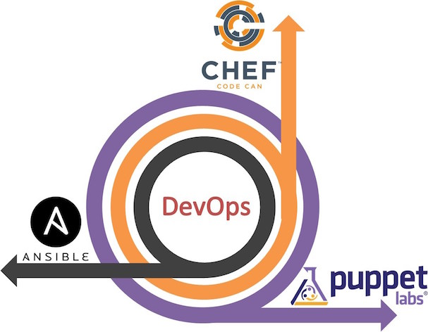

# Automatización y Por qué es tan Importante?

--------------------------------------------------

# Automatización

La Automatización permite construir ambientes idénticos una vez tras otras.
Todos los paquetes necesarios, archivos de configuración, etc.
se pueden definir de forma lógica y usarlos para construir
plataformas de forma automática y libre de errores.

--------------------------------------------------

# Provisionadores?

--------------------------------------------------

# Que es Ansible?

Es una herramienta que nos permite gestionar configuraciones,
aprovisionamiento de recursos, despliegue automático de aplicaciones y
muchas otras tareas de TI de una forma limpia y sencilla.

--------------------------------------------------

# Porque Ansible?

* Simple
* Sin Agentes
* Se Ejecuta desde la Maquina del Administrador
* Usa Python y SSH
* Modelo Push

--------------------------------------------------

# Porque Ansible?

--------------------------------------------------

# Diferencia a otras Herramientas:

* No Necesita Agentes.
* No requiere de configuraciones engorrosas y complicadas.
* Flexibilidad (API, Módulos, Plugins)
* Facilidad de uso

--------------------------------------------------

# Quienes usan Ansible.

* [Atlassian](https://www.atlassian.com/)
* [NASA](www.nasa.gov)
* [Evernote](https://www.evernote.com/)
* [Spotify](https://www.spotify.com/)
* [Verisign](https://www.verisign.es/)
* ...
* [DgNEST](http://dgnest.com/)

--------------------------------------------------

# Instalar Ansible

*Existen RPM's disponibles para EPEL 6 y 7*

## Yum

    !Bash
    $ sudo yum install ansible

--------------------------------------------------

# Instalar Ansible

## APT-Ubuntu

    !Bash
    $ sudo apt-get install software-properties-common
    $ sudo apt-add-repository ppa:ansible/ansible
    $ sudo apt-get update
    $ sudo apt-get install ansible

--------------------------------------------------

# Instalar Ansible

## Debian

    !Bash
    $ sudo apt-get update
    $ sudo apt-get install python-pip python-dev git -y
    $ sudo pip install PyYAML jinja2 paramiko
    $ git clone https://github.com/ansible/ansible.git
    $ cd ansible
    $ sudo make install
    $ sudo mkdir /etc/ansible
    $ sudo cp ~/ansible/examples/hosts /etc/ansible/

--------------------------------------------------

# Instalar Ansible

## Homebrew

    !Bash
    $ brew update
    $ brew install ansible

--------------------------------------------------

# Best Installation Recomendada

    !Bash
    $ sudo pip install ansible

--------------------------------------------------

# Copiar Key Public al server Remoto

## ~/.ssh/id_rsa.pub

    !Bash
    $ ssh-copy-id -i ~/.ssh/id_rsa.pub root@192.168.101.104

--------------------------------------------------

# Elementos de Ansible:

    !bash

    ├── hosts <- inventory
    ├── playbook.yml <-playbook
    └── roles
        └── webserver <- role webserver
            ├── files
            │   └── main.go
            └── tasks
                └── main.yml <- fichero de tareas

--------------------------------------------------

# Elementos de Ansible:

* Inventario
* Modulos
* Tarea/Task
* Plays
* PlayBooks
* Variables
* Roles
* Task Pre/Pos
* Otros

--------------------------------------------------

# Inventario:

## hosts

    !Bash

    1.web.sandbox.sophimania.pe ansible_ssh_host=192.168.20.80 ansible_ssh_port=22
    1.lb.sandbox.sophimania.pe ansible_ssh_host=192.168.20.81 ansible_ssh_port=22
    1.db.master.sandbox.sophimania.pe ansible_ssh_host=192.168.20.82 ansible_ssh_port=22

## Groups:

    !Bash
    [webservers]
    [1:1].web.sandbox.sophimania.pe

    [lbservers]
    1.lb.sandbox.sophimania.pe

    [dbservers:children]
    dbservers.masters
    dbservers.slaves

--------------------------------------------------

# Modulos:

* Los Modulos se Consideran la unidad de trabajo de ansible.
* Es codigo que se ejecuta en el equipo administrado.
* Cada Modulo es basicamente independiente y puede ser escrito en cualquier lenguaje de programacion scripts.
* Se copian por ssh hacia el equipo administrado donde son ejecutados.
* Devuelven datos en formato *JSON* que es interpretado por ansible.

--------------------------------------------------

# Modulos de Ansible (Core):

* *apt/yum/pip:* Adicionar/Desinstalar Paquetes.
* *command/shell:* Ejecutar cualquier comando de shell.
* *copy:* Copiar archivos al servidor administrado.
* *file:* Crear Directorios, Enlaces Simbolicos, Modificar Permisos.
* *service:* Iniciar/Detener/Habilitar Servicios.
* *template:* Similar a Copy, pero con reemplazo de variables.
* ...

--------------------------------------------------

# Task:

    !bash

    - name: Install Nginx Web Server
      apt: pkg=nginx state=latest

* Documentacion: 'Install Nginx Web Server'
* Modulos: apt
* Argumentos: pkg=nginx state=latest

--------------------------------------------------

# Task:

    !bash

    - name: Install common package dependencies
      apt:
        name: "{{ item }}"
        state: present
      register: install_common_package_dependencies
      when: common_package_dependencies is defined
      with_items: common_package_dependencies
      tags:
        - apt
        - dependencies

--------------------------------------------------

# PlayBooks:

## Example:

    !Bash

    - name: Common stuff for all the server
      hosts: all
      sudo: yes
      gather_facts: yes
      roles:
        - common
      tags:
        - all
        - common

    - name: Install MySQL
      hosts: dbservers
      gather_facts: yes
      sudo: yes
      roles:
        # - { role: contrib/geerlingguy.mysql, when: "user == 'vagrant'" }
        - contrib/geerlingguy.mysql
        - postgresql
      tags:
        - install
        - mysql
        - databases

--------------------------------------------------

# Variables:

* group_vars
* Hosts
* Role:
  * vars/main.yml
  * defaults/main.yml

--------------------------------------------------

# Variables:

    !bash

    user: vagrant

    app_name: "sophimania"
    app_db_name: "sophimania"
    app_dir_home: "/home/{{ user }}"
    apps_path: "{{ app_dir_home }}/{{ repository_name }}"
    app_dir: "{{ apps_path }}/{{ app_name }}"
    dir_logs_supervisor: "/var/log/supervisor"

--------------------------------------------------

# Roles:

    !bash

    ├── README.md
    ├── defaults
    │   └── main.yml
    ├── handlers
    │   └── main.yml
    ├── meta
    │   └── main.yml
    ├── tasks
    │   ├── configure.yml
    └── templates
        ├── environment.j2

--------------------------------------------------

# Roles Reutilizables:

[Ansible Galaxy](https://galaxy.ansible.com/)

## Install Normal

    !bash

    ansible-galaxy install username.rolename

## Install Advanced

    !bash

    ansible-galaxy install -r roles.txt -p provision/ansible/roles

--------------------------------------------------

# Tareas Pre/Post:

* Se pueden definir tareas que se ejecuten antes y despues que los roles
sean aplicados de la siguiente manera.

## Ejemplo:

    !bash

      - name: webservers

      pre_tasks:
      - shell: echo 'o/'

      roles:
        -{ role: some_role }

      tasks:
      - shell: echo 'still busy'

      post_tasks:
      - shell: echo 'Good Bye'

--------------------------------------------------

# Otros:

* Condicionales: Se pueden establecer condiciones para la ejecucion
de una tarea mediante la directiva *when*: que evalua la condicion
y ejecuta la tarea si el resultado es verdadero.
* notificadores/notifiers/handlers: son tareas que se ejecutan con el comando *notify*
* raw commands: se puede utilizar ansible para ejecutar comandos en los servidores remotos sin necesidad de un playbook.
* scripts: son archivos de script que se copian al servidor remoto y se ejecutan: Automatizan la ejecucion de scripts ya existentes

--------------------------------------------------

# Demo:

--------------------------------------------------

# Otras Herramientas:

* Packer
* Terraform

--------------------------------------------------

# Preguntas:

--------------------------------------------------